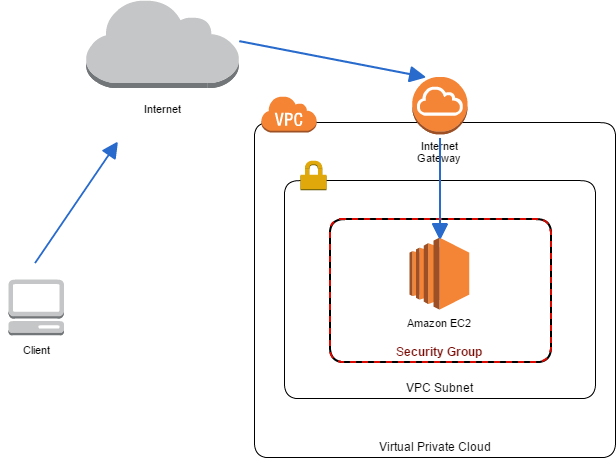

就不多廢話了，我們直接上架構圖！！



環境概述
----

Region：自己挑一個

Network

*   VPC
    
    *   CIDR：10.128.0.0/16
        
    *   Internet Gateways
        
*   Subnet
    
    *   CIDR：10.128.11.0/24
        
*   Route table
    
    *   Destination：0.0.0.0/0 , Target：igw
        

EC2：assign public ip

* * *

我習慣使用Visual Studio Code來開發，所以這邊我們就先安裝Terraform的[插件](https://marketplace.visualstudio.com/items?itemName=HashiCorp.terraform)。

接著建立`provider.tf`，來定義我們要使用的雲端平台。

這邊我們使用環境變數的方式來設定部署到SA Demo的環境去。

```shell
export AWS\_ACCESS\_KEY\_ID="anaccesskey"
export AWS\_SECRET\_ACCESS\_KEY="asecretkey"
```

```tcl
provider "aws" {
  region = "eu-west-3"
}
```

撰寫完`provider`之後，要執行下面指令來初始化

```shell
terraform init
```

每次只要有修改`provider`，都一定要記得重做一次初始化

接下來就是建立`vpc.tf`來定義我們的VPC，包括了`aws_vpc`、`aws_subnet`、`aws_internet_gateway`、`route_table_association`、`aws_route` 、`aws_route_table`。

```tcl
resource "aws\_vpc" "vpc" {
  cidr\_block           = "10.128.0.0/16"
  enable\_dns\_hostnames = "true"
  tags = {
    Name = "Circle vpc"
  }
}

resource "aws\_subnet" "subnet1" {
  vpc\_id     = aws\_vpc.vpc.id
  availability\_zone = "eu-west-3a"
  cidr\_block = "10.20.1.0/24"
  tags = {
    Name = "Circle subnet1"
  }
}

resource "aws\_internet\_gateway" "gw" {
  vpc\_id = aws\_vpc.vpc.id

  tags = {
    Name = "Circle gateway"
  }
}

resource "aws\_route\_table\_association" "a" {
  subnet\_id      = aws\_subnet.subnet1.id
  route\_table\_id = aws\_route\_table.r.id
}

resource "aws\_route" "ipv4-outbound" {
  route\_table\_id         = aws\_route\_table.r.id
  gateway\_id             = aws\_internet\_gateway.gw.id
  destination\_cidr\_block = "0.0.0.0/0"
}

resource "aws\_route\_table" "r" {
  vpc\_id = aws\_vpc.vpc.id

  tags = {
    Name = "Circle route"
  }
}
```

當然還不能忘了我們的Security Group，因為通常Security Group是最容易變動的設定，所以我習慣把它獨立在一個tf檔案中。我們建立一個，只允許公司五樓與六樓IP可以訪問22 port的Security Group。

```tcl
resource "aws\_security\_group" "sg" {
  name        = "allow\_circle"
  description = "Allow circle inbound traffic"
  vpc\_id      = aws\_vpc.vpc.id

  ingress {
    from\_port   = 22
    to\_port     = 22
    protocol    = "tcp"
    cidr\_blocks = \["220.135.202.135/32", "211.75.165.158/32"\]
  }

  tags = {
    Name = "allow\_circle"
  }
}
```

最後的最後，就是我們的EC2啦。

我們可以透過`Data`來獲取`ubuntu 20.04`版本的ami id。

當然也不能忘記我們的`aws_network_interface`以及`aws_eip`，在設定`aws_network_interface`的時候別忘了要把前面的Security Group id給加進來。

這邊有一點要注意的地方是，在設定ec2的`key_name`時，只能選擇我們雲端環境上面現有的`key pair`，Terraform並不支援建立`key pair`的服務。

```tcl
data "aws\_ami" "ubuntu" {
  most\_recent = true

  filter {
    name   = "name"
    values = \["ubuntu/images/hvm-ssd/ubuntu-focal-20.04-amd64-server-\*"\]
  }

  filter {
    name   = "virtualization-type"
    values = \["hvm"\]
  }

  owners = \["099720109477"\] # Canonical
}

resource "aws\_instance" "ec2" {
  ami               = data.aws\_ami.ubuntu.id
  instance\_type     = "t2.micro"
  key\_name          = "circle-sa-eu-west-3"

  network\_interface {
    network\_interface\_id = aws\_network\_interface.network.id
    device\_index         = 0
  }
  
  root\_block\_device{
    volume\_size = 10
  }

  tags = {
    Name = "Circle ec2"
  }
}

resource "aws\_network\_interface" "network" {
  subnet\_id       = aws\_subnet.subnet1.id
  security\_groups = \[aws\_security\_group.sg.id\]

  tags = {
    Name = "Circle network interface"
  }
}

resource "aws\_eip" "ip" {
  instance = aws\_instance.ec2.id
  tags = {
    Name = "Circle eip"
  }
}
```

最後執行下面的指令，來檢視是否正確

```shell
terraform plan -out=terraform-lab1
```

你會得到下面的輸出結果

```shell
An execution plan has been generated and is shown below.
Resource actions are indicated with the following symbols:
  + create

Terraform will perform the following actions:

  # aws\_eip.ip will be created
  + resource "aws\_eip" "ip" {
      + allocation\_id        = (known after apply)
      + association\_id       = (known after apply)
      + carrier\_ip           = (known after apply)
      + customer\_owned\_ip    = (known after apply)
      + domain               = (known after apply)
      + id                   = (known after apply)
      + instance             = (known after apply)
      + network\_border\_group = (known after apply)
      + network\_interface    = (known after apply)
      + private\_dns          = (known after apply)
      + private\_ip           = (known after apply)
      + public\_dns           = (known after apply)
      + public\_ip            = (known after apply)
      + public\_ipv4\_pool     = (known after apply)
      + tags                 = {
          + "Name" = "Circle eip"
        }
      + vpc                  = (known after apply)
    }

  # aws\_instance.ec2 will be created
  + resource "aws\_instance" "ec2" {
      + ami                          = "ami-0b209583a4a1146dd"
      + arn                          = (known after apply)
      + associate\_public\_ip\_address  = (known after apply)
      + availability\_zone            = "eu-west-3a"
      + cpu\_core\_count               = (known after apply)
      + cpu\_threads\_per\_core         = (known after apply)
      + get\_password\_data            = false
      + host\_id                      = (known after apply)
      + id                           = (known after apply)
      + instance\_state               = (known after apply)
      + instance\_type                = "t2.micro"
      + ipv6\_address\_count           = (known after apply)
      + ipv6\_addresses               = (known after apply)
      + key\_name                     = "circle-sa-eu-west-3"
      + outpost\_arn                  = (known after apply)
      + password\_data                = (known after apply)
      + placement\_group              = (known after apply)
      + primary\_network\_interface\_id = (known after apply)
      + private\_dns                  = (known after apply)
      + private\_ip                   = (known after apply)
      + public\_dns                   = (known after apply)
      + public\_ip                    = (known after apply)
      + secondary\_private\_ips        = (known after apply)
      + security\_groups              = (known after apply)
      + subnet\_id                    = (known after apply)
      + tags                         = {
          + "Name" = "Circle ec2"
        }
      + tenancy                      = (known after apply)
      + volume\_tags                  = (known after apply)
      + vpc\_security\_group\_ids       = (known after apply)

      + ebs\_block\_device {
          + delete\_on\_termination = (known after apply)
          + device\_name           = (known after apply)
          + encrypted             = (known after apply)
          + iops                  = (known after apply)
          + kms\_key\_id            = (known after apply)
          + snapshot\_id           = (known after apply)
          + throughput            = (known after apply)
          + volume\_id             = (known after apply)
          + volume\_size           = (known after apply)
          + volume\_type           = (known after apply)
        }

      + enclave\_options {
          + enabled = (known after apply)
        }

      + ephemeral\_block\_device {
          + device\_name  = (known after apply)
          + no\_device    = (known after apply)
          + virtual\_name = (known after apply)
        }

      + metadata\_options {
          + http\_endpoint               = (known after apply)
          + http\_put\_response\_hop\_limit = (known after apply)
          + http\_tokens                 = (known after apply)
        }

      + network\_interface {
          + delete\_on\_termination = false
          + device\_index          = 0
          + network\_interface\_id  = (known after apply)
        }

      + root\_block\_device {
          + delete\_on\_termination = true
          + device\_name           = (known after apply)
          + encrypted             = (known after apply)
          + iops                  = (known after apply)
          + kms\_key\_id            = (known after apply)
          + throughput            = (known after apply)
          + volume\_id             = (known after apply)
          + volume\_size           = 10
          + volume\_type           = (known after apply)
        }
    }

  # aws\_internet\_gateway.gw will be created
  + resource "aws\_internet\_gateway" "gw" {
      + arn      = (known after apply)
      + id       = (known after apply)
      + owner\_id = (known after apply)
      + tags     = {
          + "Name" = "Circle gateway"
        }
      + vpc\_id   = (known after apply)
    }

  # aws\_network\_interface.network will be created
  + resource "aws\_network\_interface" "network" {
      + id                 = (known after apply)
      + ipv6\_address\_count = (known after apply)
      + ipv6\_addresses     = (known after apply)
      + mac\_address        = (known after apply)
      + outpost\_arn        = (known after apply)
      + private\_dns\_name   = (known after apply)
      + private\_ip         = (known after apply)
      + private\_ips        = (known after apply)
      + private\_ips\_count  = (known after apply)
      + security\_groups    = (known after apply)
      + source\_dest\_check  = true
      + subnet\_id          = (known after apply)
      + tags               = {
          + "Name" = "Circle network interface"
        }

      + attachment {
          + attachment\_id = (known after apply)
          + device\_index  = (known after apply)
          + instance      = (known after apply)
        }
    }

  # aws\_route.ipv4-outbound will be created
  + resource "aws\_route" "ipv4-outbound" {
      + destination\_cidr\_block     = "0.0.0.0/0"
      + destination\_prefix\_list\_id = (known after apply)
      + egress\_only\_gateway\_id     = (known after apply)
      + gateway\_id                 = (known after apply)
      + id                         = (known after apply)
      + instance\_id                = (known after apply)
      + instance\_owner\_id          = (known after apply)
      + local\_gateway\_id           = (known after apply)
      + nat\_gateway\_id             = (known after apply)
      + network\_interface\_id       = (known after apply)
      + origin                     = (known after apply)
      + route\_table\_id             = (known after apply)
      + state                      = (known after apply)
    }

  # aws\_route\_table.r will be created
  + resource "aws\_route\_table" "r" {
      + id               = (known after apply)
      + owner\_id         = (known after apply)
      + propagating\_vgws = (known after apply)
      + route            = (known after apply)
      + tags             = {
          + "Name" = "Circle route"
        }
      + vpc\_id           = (known after apply)
    }

  # aws\_route\_table\_association.a will be created
  + resource "aws\_route\_table\_association" "a" {
      + id             = (known after apply)
      + route\_table\_id = (known after apply)
      + subnet\_id      = (known after apply)
    }

  # aws\_security\_group.sg will be created
  + resource "aws\_security\_group" "sg" {
      + arn                    = (known after apply)
      + description            = "Allow circle inbound traffic"
      + egress                 = (known after apply)
      + id                     = (known after apply)
      + ingress                = \[
          + {
              + cidr\_blocks      = \[
                  + "220.135.202.135/32",
                  + "211.75.165.158/32",
                \]
              + description      = ""
              + from\_port        = 22
              + ipv6\_cidr\_blocks = \[\]
              + prefix\_list\_ids  = \[\]
              + protocol         = "tcp"
              + security\_groups  = \[\]
              + self             = false
              + to\_port          = 22
            },
        \]
      + name                   = "allow\_circle"
      + owner\_id               = (known after apply)
      + revoke\_rules\_on\_delete = false
      + tags                   = {
          + "Name" = "allow\_circle"
        }
      + vpc\_id                 = (known after apply)
    }

  # aws\_subnet.subnet1 will be created
  + resource "aws\_subnet" "subnet1" {
      + arn                             = (known after apply)
      + assign\_ipv6\_address\_on\_creation = false
      + availability\_zone               = "eu-west-3a"
      + availability\_zone\_id            = (known after apply)
      + cidr\_block                      = "10.128.1.0/24"
      + id                              = (known after apply)
      + ipv6\_cidr\_block\_association\_id  = (known after apply)
      + map\_public\_ip\_on\_launch         = false
      + owner\_id                        = (known after apply)
      + tags                            = {
          + "Name" = "Circle subnet1"
        }
      + vpc\_id                          = (known after apply)
    }

  # aws\_vpc.vpc will be created
  + resource "aws\_vpc" "vpc" {
      + arn                              = (known after apply)
      + assign\_generated\_ipv6\_cidr\_block = false
      + cidr\_block                       = "10.128.0.0/16"
      + default\_network\_acl\_id           = (known after apply)
      + default\_route\_table\_id           = (known after apply)
      + default\_security\_group\_id        = (known after apply)
      + dhcp\_options\_id                  = (known after apply)
      + enable\_classiclink               = (known after apply)
      + enable\_classiclink\_dns\_support   = (known after apply)
      + enable\_dns\_hostnames             = true
      + enable\_dns\_support               = true
      + id                               = (known after apply)
      + instance\_tenancy                 = "default"
      + ipv6\_association\_id              = (known after apply)
      + ipv6\_cidr\_block                  = (known after apply)
      + main\_route\_table\_id              = (known after apply)
      + owner\_id                         = (known after apply)
      + tags                             = {
          + "Name" = "Circle vpc"
        }
    }

Plan: 10 to add, 0 to change, 0 to destroy.

------------------------------------------------------------------------

This plan was saved to: terraform-lab1

To perform exactly these actions, run the following command to apply:
    terraform apply "terraform-lab1"
 ```

都沒問的的話，我們接著再執行下面的指令來部署我們的環境

```shell
terraform apply terraform-lab1
```

你會得到下面的輸出結果

```shell
aws\_vpc.vpc: Creating...
aws\_vpc.vpc: Still creating... \[10s elapsed\]
aws\_vpc.vpc: Creation complete after 17s \[id=vpc-09ecccef1a8c265ec\]
aws\_internet\_gateway.gw: Creating...
aws\_route\_table.r: Creating...
aws\_subnet.subnet1: Creating...
aws\_security\_group.sg: Creating...
aws\_route\_table.r: Creation complete after 4s \[id=rtb-0e97927b260c22678\]
aws\_subnet.subnet1: Creation complete after 4s \[id=subnet-01c27a5431a15c968\]
aws\_route\_table\_association.a: Creating...
aws\_route\_table\_association.a: Creation complete after 2s \[id=rtbassoc-00ea42bdcd43f2f2a\]
aws\_internet\_gateway.gw: Creation complete after 7s \[id=igw-0805cd1c92a5143b9\]
aws\_route.ipv4-outbound: Creating...
aws\_security\_group.sg: Creation complete after 10s \[id=sg-0c63ba0e322ec8e51\]
aws\_network\_interface.network: Creating...
aws\_route.ipv4-outbound: Creation complete after 4s \[id=r-rtb-0e97927b260c226781080289494\]
aws\_network\_interface.network: Still creating... \[10s elapsed\]
aws\_network\_interface.network: Still creating... \[20s elapsed\]
aws\_network\_interface.network: Still creating... \[30s elapsed\]
aws\_network\_interface.network: Creation complete after 34s \[id=eni-0b7cef699193a9a04\]
aws\_instance.ec2: Creating...
aws\_instance.ec2: Still creating... \[10s elapsed\]
aws\_instance.ec2: Still creating... \[20s elapsed\]
aws\_instance.ec2: Still creating... \[30s elapsed\]
aws\_instance.ec2: Creation complete after 38s \[id=i-0692c45e69261a444\]
aws\_eip.ip: Creating...
aws\_eip.ip: Creation complete after 6s \[id=eipalloc-002df7dd52853dc68\]

Apply complete! Resources: 10 added, 0 changed, 0 destroyed.

The state of your infrastructure has been saved to the path
below. This state is required to modify and destroy your
infrastructure, so keep it safe. To inspect the complete state
use the \`terraform show\` command.

State path: terraform.tfstate
```

最後在結束這個lab的時候要記得使用下面指令來刪除我們所建置的環境喔

```shell
terraform destroy
```