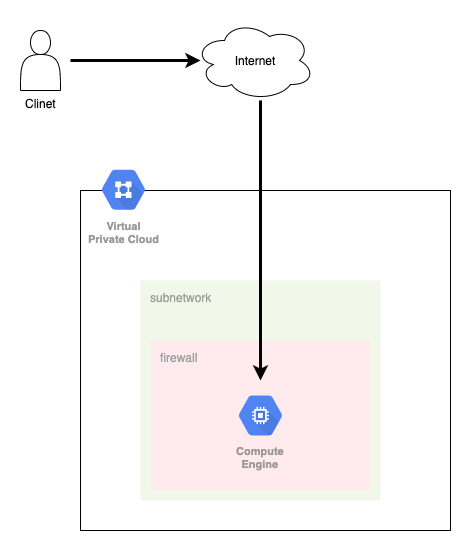
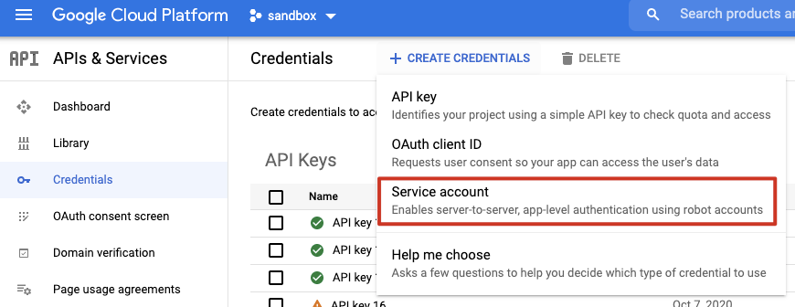
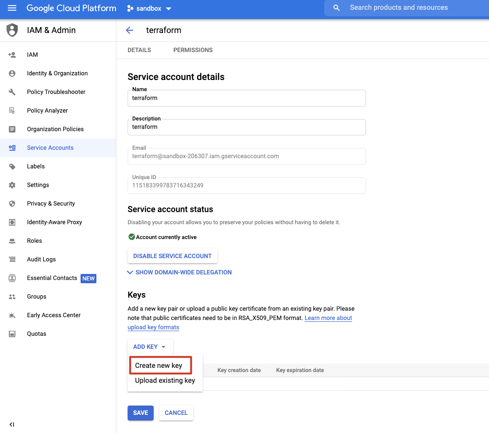
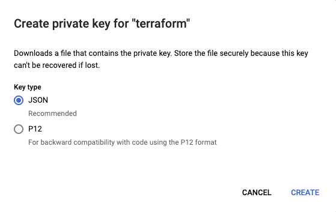
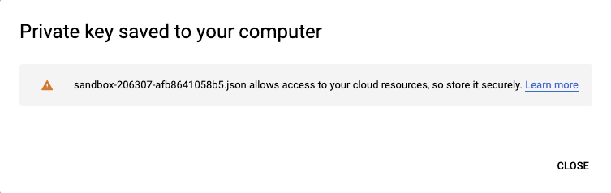

就不多廢話了，我們直接上架構圖！！



環境概述
----

Region：自己挑一個

Network

*   Subnet
    
    *   CIDR：`10.2.0.0/16`
        

VM

*   Machine type : `f1-micro`
    
*   Image : `debian-cloud/debian-9`
    

* * *

我習慣使用Visual Studio Code來開發，所以這邊我們就先安裝Terraform的[插件](https://marketplace.visualstudio.com/items?itemName=HashiCorp.terraform)。

### Provider

接著建立`provider.tf`，來定義我們要使用的雲端平台。

這邊我們使用`credentials`的方式來設定部署到sandbox的環境去。

```tcl
provider "google" {
  credentials = file("account.json")
  project     = "sandbox-206307"
  region      = "asia-east1"
  zone        = "asia-east1-b"
}
```
這邊需要去`APIs & Services` > `Credentials`去建立Service Account



創建完後，可以在下面找到件好的Account，然後點擊編輯


接著點擊`ADD KEY` > `Create new key`



Key type選擇JSON



我們再把下載下來的金鑰檔案更名為`account.json`放到我們的Lab目錄底下



撰寫完`provider`之後，要執行下面指令來初始化

``` shell
terraform init
```

每次只要有修改`provider`，都一定要記得重做一次初始化

### VPC

接下來就是建立`vpc.tf`來定義我們的VPC，包括了`google_compute_network`、`google_compute_subnetwork`。

```tcl
 resource "google\_compute\_network" "my\_vpc" {
  name = "circle-vpc"
  auto\_create\_subnetworks = false
}

resource "google\_compute\_subnetwork" "my\_subnetwork" {
  name          = "asia-east1-my-subnetwork"
  ip\_cidr\_range = "10.2.0.0/16"
  region        = "asia-east1"
  network       = google\_compute\_network.my\_vpc.name
}
```

### Firewall

當然還不能忘了我們的`firewall`，因為通常`firewall`是最容易變動的設定，所以我習慣把它獨立在一個tf檔案中。我們建立一個，只允許公司五樓與六樓IP可以訪問22 port以及icmp的`firewall`。

```tcl
resource "google\_compute\_firewall" "my\_firewall" {
  name    = "circle-firewall"
  network = google\_compute\_network.my\_vpc.name

  allow {
    protocol = "icmp"
  }

  allow {
    protocol = "tcp"
    ports    = \["22"\]
  }

  source\_ranges = \[ "220.135.202.135/32", "211.75.165.158/32" \]
  source\_tags = \["circle-ssh"\]
}
```

最後的最後，就是我們的GCE啦。

在設定的時候別忘了要把前面的`firewall`tag給加進來。

```tcl
resource "google\_compute\_instance" "my\_vm" {
  name         = "circle-instance"
  machine\_type = "f1-micro"

  allow\_stopping\_for\_update = true

  tags = \["circle-ssh"\]

  boot\_disk {
    initialize\_params {
      image = "debian-cloud/debian-9"
    }
  }

  network\_interface {
    network = google\_compute\_network.my\_vpc.name
    subnetwork = google\_compute\_subnetwork.my\_subnetwork.name
  }
}
```

最後執行下面的指令，來檢視是否正確

```shell
terraform plan -out=terraform-lab1
```

你會得到下面的輸出結果

```shell
An execution plan has been generated and is shown below.
Resource actions are indicated with the following symbols:
  + create

Terraform will perform the following actions:

  # google\_compute\_firewall.firewall will be created
  + resource "google\_compute\_firewall" "firewall" {
      + creation\_timestamp = (known after apply)
      + destination\_ranges = (known after apply)
      + direction          = (known after apply)
      + enable\_logging     = (known after apply)
      + id                 = (known after apply)
      + name               = "circle-firewall"
      + network            = "circle-vpc"
      + priority           = 1000
      + project            = (known after apply)
      + self\_link          = (known after apply)
      + source\_ranges      = \[
          + "211.75.165.158/32",
          + "220.135.202.135/32",
        \]
      + source\_tags        = \[
          + "circle-ssh",
        \]

      + allow {
          + ports    = \[
              + "22",
            \]
          + protocol = "tcp"
        }
      + allow {
          + ports    = \[\]
          + protocol = "icmp"
        }
    }

  # google\_compute\_instance.vm\_instance will be created
  + resource "google\_compute\_instance" "vm\_instance" {
      + allow\_stopping\_for\_update = true
      + can\_ip\_forward            = false
      + cpu\_platform              = (known after apply)
      + current\_status            = (known after apply)
      + deletion\_protection       = false
      + guest\_accelerator         = (known after apply)
      + id                        = (known after apply)
      + instance\_id               = (known after apply)
      + label\_fingerprint         = (known after apply)
      + machine\_type              = "f1-micro"
      + metadata\_fingerprint      = (known after apply)
      + min\_cpu\_platform          = (known after apply)
      + name                      = "circle-instance"
      + project                   = (known after apply)
      + self\_link                 = (known after apply)
      + tags                      = \[
          + "circle-web",
        \]
      + tags\_fingerprint          = (known after apply)
      + zone                      = (known after apply)

      + boot\_disk {
          + auto\_delete                = true
          + device\_name                = (known after apply)
          + disk\_encryption\_key\_sha256 = (known after apply)
          + kms\_key\_self\_link          = (known after apply)
          + mode                       = "READ\_WRITE"
          + source                     = (known after apply)

          + initialize\_params {
              + image  = "debian-cloud/debian-9"
              + labels = (known after apply)
              + size   = (known after apply)
              + type   = (known after apply)
            }
        }

      + confidential\_instance\_config {
          + enable\_confidential\_compute = (known after apply)
        }

      + network\_interface {
          + name               = (known after apply)
          + network            = "circle-vpc"
          + network\_ip         = (known after apply)
          + subnetwork         = "asia-east1-subnetwork1"
          + subnetwork\_project = (known after apply)

          + access\_config {
              + nat\_ip       = (known after apply)
              + network\_tier = (known after apply)
            }
        }

      + scheduling {
          + automatic\_restart   = (known after apply)
          + on\_host\_maintenance = (known after apply)
          + preemptible         = (known after apply)

          + node\_affinities {
              + key      = (known after apply)
              + operator = (known after apply)
              + values   = (known after apply)
            }
        }
    }

  # google\_compute\_network.vpc will be created
  + resource "google\_compute\_network" "vpc" {
      + auto\_create\_subnetworks         = false
      + delete\_default\_routes\_on\_create = false
      + gateway\_ipv4                    = (known after apply)
      + id                              = (known after apply)
      + mtu                             = (known after apply)
      + name                            = "circle-vpc"
      + project                         = (known after apply)
      + routing\_mode                    = (known after apply)
      + self\_link                       = (known after apply)
    }

  # google\_compute\_subnetwork.subnetwork1 will be created
  + resource "google\_compute\_subnetwork" "subnetwork1" {
      + creation\_timestamp         = (known after apply)
      + fingerprint                = (known after apply)
      + gateway\_address            = (known after apply)
      + id                         = (known after apply)
      + ip\_cidr\_range              = "10.2.0.0/16"
      + name                       = "asia-east1-subnetwork1"
      + network                    = (known after apply)
      + private\_ipv6\_google\_access = (known after apply)
      + project                    = (known after apply)
      + region                     = "asia-east1"
      + secondary\_ip\_range         = (known after apply)
      + self\_link                  = (known after apply)
    }

Plan: 4 to add, 0 to change, 0 to destroy.

------------------------------------------------------------------------

This plan was saved to: terraform-lab1

To perform exactly these actions, run the following command to apply:
    terraform apply "terraform-lab1"
```

都沒問題的話，我們接著再執行下面的指令來部署我們的環境

```shell
terraform apply terraform-lab1
```

你會得到下面的輸出結果

```shell
google\_compute\_network.vpc: Creating...
google\_compute\_network.vpc: Still creating... \[10s elapsed\]
google\_compute\_network.vpc: Still creating... \[20s elapsed\]
google\_compute\_network.vpc: Still creating... \[30s elapsed\]
google\_compute\_network.vpc: Still creating... \[40s elapsed\]
google\_compute\_network.vpc: Creation complete after 44s \[id=projects/sandbox-206307/global/networks/circle-vpc\]
google\_compute\_subnetwork.subnetwork1: Creating...
google\_compute\_firewall.firewall: Creating...
google\_compute\_firewall.firewall: Still creating... \[10s elapsed\]
google\_compute\_subnetwork.subnetwork1: Still creating... \[10s elapsed\]
google\_compute\_subnetwork.subnetwork1: Creation complete after 13s \[id=projects/sandbox-206307/regions/asia-east1/subnetworks/asia-east1-subnetwork1\]
google\_compute\_instance.vm\_instance: Creating...
google\_compute\_firewall.firewall: Creation complete after 14s \[id=projects/sandbox-206307/global/firewalls/circle-firewall\]
google\_compute\_instance.vm\_instance: Still creating... \[10s elapsed\]
google\_compute\_instance.vm\_instance: Creation complete after 16s \[id=projects/sandbox-206307/zones/asia-east1-b/instances/circle-instance\]

Apply complete! Resources: 4 added, 0 changed, 0 destroyed.

The state of your infrastructure has been saved to the path
below. This state is required to modify and destroy your
infrastructure, so keep it safe. To inspect the complete state
use the \`terraform show\` command.

State path: terraform.tfstate
```

最後在結束這個lab的時候要記得使用下面指令來刪除我們所建置的環境喔

```shell
terraform destroy
```
